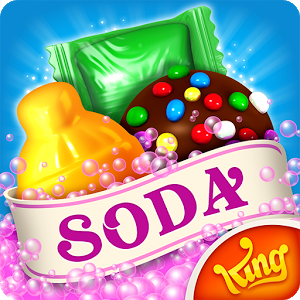
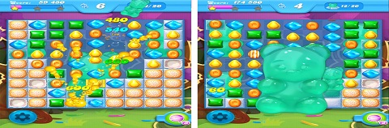
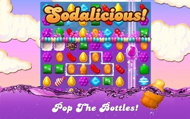
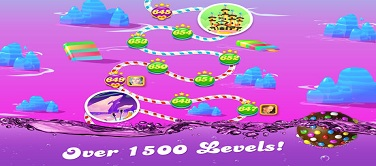
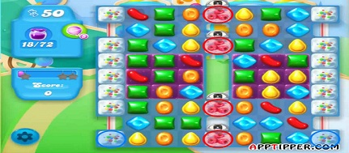
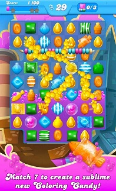
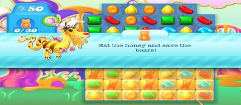

<body>
  <h1>Review Game : <i>Candy Crush Soda</i></h1> 
  
Ria Lestari Simamora

  
3145140589

  
Ilmu Komputer 2014

  
Candy Crush Soda Review

  

  
Candy Crush Soda adalah salah satu game karya developer king yang saat ini telah meriliskan lanjutan dari game adiktif sebelumnya, yaitu Candy Crush Saga. Secara garis besar, game rilisan terbaru developer king ini masih sama dengan game sebelumnya, yaitu Candy Crush Saga yang harus mengumpulkan poin untuk menang. Perbedaannya adalah pada game rilisan versi terbarunya ini, player harus memasangkan permen dengan soda yang berwarna sama untuk membuka tutup botol soda dan akan memperoleh tantangan yang lebih sulit dengan menghadapi gummy bears, permen kenyal dalam bentuk teddy bears yang harus ditemukan dibalik grid puzzle. 

  

  
Grafis pada game ini sudah bagus. Tampilan di android sangat menarik, desainnya sangat simpel, cantik dan penuh warna, kombinasi warna-warni permen dan kartun yang lucu membuat kita selalu ingin memainkan nya. Untuk efek suara, pada game ini memiliki efek suara yang berbeda dari rilisan sebelumnya. Pada game Candy Crush Saga ada efek suara animasi “Sugar Crush” tetapi untuk game ini efek suaranya adalah “Sodalicious”.  Visual yang ditampilkan warna-warni dan sangat lucu. Game ini bisa dimainkan melalui akun facebook dan bisa di download di AndroidOS atau iOS secara gratis. Untuk memulai game ini tidak perlu menuggu lama karena proses loadingnya sangat cepat. 

  

  
Tantangan yang diberikan oleh game ini juga bervariasi sehingga tidak cepat bosan memainkan nya. Game ini  juga bisa dimainkan sendiri tanpa harus terhubung dengan teman-teman. Meski begitu, menantang teman-teman Facebook bermain serta berbagi prestasi akan memberikan keuntungan tertentu yang dibutuhkan untuk bisa terus melaju ke level berikutnya.

  

  
Secara teknis, Soda Saga juga tidak jauh berbeda dengan Candy Crush Saga. Kita masih harus mencetak poin dengan memasangkan 3 buah permen atau lebih, tapi ada yang sedikit berbeda disini. Kita harus memasangkan permen dengan botol soda yang berwarna sama untuk membuka tutup botol soda besar, progresnya ditandai dengan cairan ungu di belakang grid yang semakin meningkat kalau kita popping botol-botol soda.
  

  
Bahkan di beberapa level tertentu kita juga akan menemui gummy bears, permen kenyal berbentuk teddy bear, yang harus di buat mengambang di grid puzzle. Dan masih banyak lagi level-level unik lainnya di dalam Candy Crush   Soda Saga seperti membersihkan grid papan game dari batang coklat, melepaskan teddy bear dari jebakan madu yang lengket, dan menyelamatkan teddy bear dari balok es dengan memasangkan permen-permen manis di dekat balok es tersebut.

  

  

  
Game ini tidak sepenuhnya gratis, apabila nyawa sudah habis dan kita tidak sabar untuk mendapatkan nya kita harus membayar. Begitu juga dengan bonus bantuan yang akan membantu kita untuk menang lebih cepat. Candy crush soda juga memiliki kekurangan lainnya, yaitu spam ke semua teman facebook untuk meminta extra lives atau bantuan ke level selanjutnya, padahal belum tentu mereka ingin memainkan game ini dan tidak merasa terganggu dengan notifikasi nya.

  
<strong>Kesimpulan :</strong> 
  Alasan meangapa saya mendownload dan sangat menyukai game ini karena trailernya yang sangat menarik dan saya sangat suka tantangan match three game. Apalagi visual nya juga menarik. Awalnya saya pikir game ini sangat gampang, tetapi setelah saya melalui beberapa level, ternyata game ini tidak gampang dilalui, harus sabar kalau nyawa nya sudah habis dan stuck di level itu cukup lama. Game ini juga melatih kesabaran pemain untuk menunggu sampai nyawa penuh kembali dan dapat bermain lagi.

